# javascript(ES6) 前端数据结构与算法

## Stack 栈结构

### 栈常见的操作

- `push()` 添加一个新元素到栈顶位置。
- `pop()` 移除栈顶的元素，同时返回被移除的元素。
- `peek()` 返回栈顶的元素，不对栈做任何修改（该方法不会移除栈顶的元素，仅仅返回它）。
- `isEmpty()` 如果栈里没有任何元素就返回 `true`，否则返回 `false`。
- `size()` 返回栈里的元素个数。这个方法和数组的 `length` 属性类似。
- `toString()` 将栈结构的内容以字符串的形式返回。

### JavaScript 实现栈结构

```js
class Stack {
  constructor() {
    this.items = [];
  }
  push(el) {
    this.items.push(el);
  }
  pop() {
    return this.items.pop();
  }
  peek() {
    if (this.items.length === 0) return null;
    return this.items[this.items.length - 1];
  }
  isEmpty() {
    return this.items.length === 0;
  }
  size() {
    return this.items.length;
  }
  toString() {
    let str = "";
    for (let i = 0; i < this.items.length; i++) {
      str += this.items[i];
    }
    return str;
  }
}
```

### 利用栈结构实现 十进制变成二进制

---

```js
function toBinary(num) {
  let stack = new Stack();
  while (num > 0) {
    stack.push(num % 2);
    num = Math.floor(num / 2);
  }
  let res = "";
  while (!stack.isEmpty()) {
    res += stack.pop();
  }
  return res;
}
```

## Queue 队列

---

### 队列常见的操作

- `enqueue(element)` 向队列尾部添加一个（或多个）新的项。
- `dequeue()` 移除队列的第一（即排在队列最前面的）项，并返回被移除的元素。
- `front()` 返回队列中的第一个元素——最先被添加，也将是最先被移除的元素。队列不做任何变动（不移除元素，只返回元素信息与 Map 类的 peek 方法非常类似）。
- `isEmpty()` 如果队列中不包含任何元素，返回 true，否则返回 false。
- `size()` 返回队列包含的元素个数，与数组的 length 属性类似。
- `toString()` 将队列中的内容，转成字符串形式。

### JavaScript 实现队列

---

```js
class Queue {
  constructor() {
    this.items = [];
  }
  enqueue(el) {
    this.items.push(el);
  }
  dequeue() {
    return this.items.shift();
  }
  front() {
    if (this.items.length === 0) return null;
    return this.items[0];
  }
  isEmpty() {
    return this.items.length === 0;
  }
  size() {
    return this.items.length;
  }
  toString() {
    let str = "";
    for (let i = 0; i < this.items.length; i++) {
      str += this.items[i];
    }
    return str;
  }
}
```

### 队列的应用

使用队列实现小游戏：**击鼓传花**。

?> 分析：传入一组数据集合和设定的数字 number，循环遍历数组内元素，遍历到的元素为指定数字 number 时将该元素删除，直至数组剩下一个元素。

```js
function passGame(nameList, num) {
  let queue = new Queue();
  /* 先插入元素 */
  for (let i = 0; i < nameList.length; i++) {
    queue.enqueue(nameList[i]);
  }
  while (queue.size() > 1) {
    for (let i = 0; i < num - 1; i++) {
      /* 把队列头部的元素放在尾部，这样就算num大于队列长度也不会出错*/
      queue.enqueue(queue.dequeue());
    }
    queue.dequeue();
  }
  return queue.front();
}
```

### PriorityQueue 优先级队列

---

优先级队列主要考虑的问题：

- 每个元素不再只是一个数据，还包含优先级。
- 在添加元素过程中，根据优先级放入到正确位置。

```js
// 优先队列内部的元素类
class QueueElement {
  constructor(element, priority) {
    this.element = element;
    this.priority = priority;
  }
}

// 优先队列类（继承 Queue 类）
export class PriorityQueue extends Queue {
  constructor() {
    super();
  }

  // enqueue(element, priority) 入队，将元素按优先级加入到队列中
  // 重写 enqueue()
  enqueue(el, priority) {
    // 根据传入的元素，创建 QueueElement 对象
    const queueElement = new QueueElement(el, priority);
    if (this.isEmpty()) this.items.push(queueElement);
    else {
      let added = false;
      /* 优先级越小越高 */
      for (let i = 0; i < this.size(); i++) {
        if (this.items[i].priority > queueElement.priority) {
          this.items.splice(i, 0, queueElement);
          added = true;
          break;
        }
      }
      if (!added) {
        this.items.push(queueElement);
      }
    }
  }

  // dequeue() 出队，从队列中删除前端元素，返回删除的元素
  // 继承 Queue 类的 dequeue()
  dequeue() {
    return super.dequeue();
  }

  // front() 查看队列的前端元素
  // 继承 Queue 类的 front()
  front() {
    return super.front();
  }

  // isEmpty() 查看队列是否为空
  // 继承 Queue 类的 isEmpty()
  isEmpty() {
    return super.isEmpty();
  }

  // size() 查看队列中元素的个数
  // 继承 Queue 类的 size()
  size() {
    return super.size();
  }

  // toString() 将队列中元素以字符串形式返回
  // 重写 toString()
  toString() {
    let result = "";
    for (let item of this.items) {
      result += item.element + "-" + item.priority + " ";
    }
    return result;
  }
}
```


## 字典

---

字典存储的是键值对，这个就非常简单了，我们来直接用代码实现吧。

```js
// 字典结构的封装
export default class Map {
  constructor() {
    this.items = {};
  }
  // has(key) 判断字典中是否存在某个 key
  has(key) {
    return this.items.hasOwnProperty(key);
  }
  // set(key, value) 在字典中添加键值对
  set(key, value) {
    this.items[key] = value;
  }
  // remove(key) 在字典中删除指定的 key
  remove(key) {
    // 如果集合不存在该 key，返回 false
    if (!this.has(key)) return false;
    delete this.items[key];
  }
  // get(key) 获取指定 key 的 value，如果没有，返回 undefined
  get(key) {
    return this.has(key) ? this.items[key] : undefined;
  }
  // 获取所有的 key
  keys() {
    return Object.keys(this.items);
  }
  // 获取所有的 value
  values() {
    return Object.values(this.items);
  }
  // size() 获取字典中的键值对个数
  size() {
    return this.keys().length;
  }
  // clear() 清空字典中所有的键值对
  clear() {
    this.items = {};
  }
}
```

## 链表

---

### 单向链表

> 单向链表是由一个一个节点链接而成的，链表只可以从 **head** 开始遍历。链表元素在内存中不必是连续的空间，因此可以实现内存动态管理；它的长度可以无限延申；插入以及删除元素的效率高

> **节点的封装**：

```js
class Node {
  constructor(data) {
    this.data = data;
    this.next = null;
  }
}
```

**单向链表的封装**:

```js
class LinkedList {
  constructor() {
    this.length = 0;
    this.head = null;
  }
  /* 方法 */
  append(data) {
    let newNode = new Node(data);
    if (!this.head) {
      this.head = newNode;
    } else {
      let current = this.head;
      while (current.next) {
        current = current.next;
      }
      current.next = newNode;
    }
    this.length++;
  }
  insert(position, data) {
    let newNode = new Node(data);
    if (position < 0 || position > this.length) return false;
    if (position === 0) {
      newNode.next = this.head;
      this.head = newNode;
    } else {
      let index = 0;
      let current = this.head;
      let prev = null;
      while (index++ < position) {
        prev = current;
        current = current.next;
      }
      newNode.next = current;
      prev.next = newNode;
    }
    this.length++;
    return true;
  }
  get(position) {
    let index = 0;
    let current = this.head;
    if (position < 0 || position > this.length - 1) return null;
    while (index++ < position) {
      current = current.next;
    }
    return current;
  }
  indexOf(data) {
    if (!this.head) return -1;
    let current = this.head;
    let index = 0;
    while (current) {
      if (current.data === data) {
        return index;
      }
      current = current.next;
      index++;
    }
    return -1;
  }
  removeAt(position) {
    if (position < 0 || position > this.length - 1) return null;
    let index = 0;
    let current = this.head;
    let prev = null;
    if (position === 0) {
      this.head = current.next;
    } else {
      while (index++ < position) {
        prev = current;
        current = current.next;
      }
      prev.next = current.next;
      current.next = null;
    }
    this.length--;
    return current.data;
  }
  update(position, data) {
    let res = this.removeAt(position);
    this.insert(position, data);
    return res;
  }
  remove(data) {
    const index = this.indexOf(data);
    if (index === -1) return;
    this.removeAt(index);
  }
  isEmpty() {
    return this.length === 0 ? true : false;
  }
  size() {
    return this.length;
  }
}
```

- `append()`: 在链表尾部插入节点。
- `insert()`：找到位置索引，引入当前节点和上一位节点，先将新节点指向当前节点，再断开上一位的链接，并指向新节点。
- `removeAt()`：找到位置索引，引入当前节点和上一位节点，先将上一位节点指向当前节点的后一位节点，再将当前节点指向 NULL，此时当前节点就断开了与链表的链接，会被自动清除内存空间。

### 双向链表

> 双向链表与单向链表最大的不同，就是每个节点还有一个 prev 指针，指向前一个节点。首节点的 prev 以及未节点的 next 为 null。链表除了 head 以外，还有一个 tail 指向尾节点

我们可以使用继承来实现双向链表的封装：

```js
class DoubleNode extends Node {
  constructor(data) {
    super(data);
    this.prev = null;
  }
}
```

```js
export class DoublyLinkedList extends LinkedList {
  constructor() {
    super();
    this.tail = null;
  }
}
```

然后让我们用 JavaScript 来实现双向链表的各种方法吧！

- `append` 添加元素

!> 这里要注意节点的 next 和 prev 的指向

```js
append(data) {
        const newNode = new DoubleNode(data)
        if (!this.head) {
            this.head = newNode
            this.tail = newNode
        } else {
            this.tail.next = newNode
            newNode.prev = this.tail
            this.tail = newNode
        }
        this.length++
    }
```

- `insert` 插入元素

!> 这里要注意插入节点的时候，前后两个节点的 next 和 prev 的指向

```js
insert(position, data) {
        if (position < 0 || position > this.length) return false
        const newNode = new DoubleNode(data)
        /* 特殊情况 */
        if (position === 0) {
          if(!this.head){
            this.head = newNode
            this.tail = newNode
          }else{
            this.head.prev = newNode
            newNode.next = this.head
            this.head = newNode
          }
        } else if (position === this.length) {
            this.tail.next = newNode
            newNode.prev = this.tail
            this.tail = newNode
        } else {
            let current = this.head
            let prevnode = null
            let index = 0
            while (index++ < position) {
                prevnode = current
                current = current.next
            }
            /* 这里注意有4个指针需要断开重连 */
            current.prev = newNode
            newNode.next = current
            newNode.prev = prevnode
            prevnode.next = newNode
        }
        this.length++
        return true
}
```

- `removeAt` 删除元素

```js
removeAt(position) {
        if (position < 0 || position > this.length - 1) return false
        if (position === 0) {
            if (this.length === 1) {
                this.head = null
                this.tail = null
            } else {
                this.head.next.prev = null
                this.head = this.head.next
            }
        } else if (position === this.length - 1) {
            this.tail = this.tail.prev
            this.tail.next = null
        } else {
            let index = 0
            let current = this.head
            let prevnode = null
            if (index++ < position) {
                prevnode = current
                current = current.next
            }
            prevnode.next = current.next
            current.next.prev = prevnode
            /* current.next = null
            current.prev = null */
        }
        this.length--
        return true
    }

```

- 顺序倒序输出字符串

```js
/*  链表数据从后往前以字符串形式返回 */
    backwardString() {
        let current = this.tail
        let str = ''
        while (current) {
            str += current.data + '---'
            current = current.prev
        }
        return str
    }
    /*  链表数据从前往后以字符串形式返回 */
    forwardToString() {
        let current = this.head
        let str = ''
        while (current) {
            str += current.data + '---'
            current = current.next
        }
        return str
    }
```

## 哈希表

---

哈希表是一种非常重要的数据结构，几乎所有的编程语言都直接或者间接应用这种数据结构。

哈希表通常是基于数组实现的，但是相对于数组，**它存在更多优势：**

- 哈希表可以提供非常快速的 插入-删除-查找 操作。
- 无论多少数据，插入和删除值都只需接近常量的时间，即 O(1) 的时间复杂度。实际上，只需要几个机器指令即可完成。
- 哈希表的速度比树还要快，基本可以瞬间查找到想要的元素。
- 哈希表相对于树来说编码要简单得多。

** 哈希表同样存在不足之处：**

- 哈希表中的数据是没有顺序的，所以不能以一种固定的方式（比如从小到大 ）来遍历其中的元素。
- 通常情况下，哈希表中的 key 是不允许重复的，不能放置相同的 key，用于保存不同的元素。

?> 哈希表的结构就是**数组**，但它神奇之处在于对下标值的一种变换，这种变换我们可以称之为**哈希函数**，通过哈希函数可以获取 **HashCode**。哈希表能够通过哈希函数把字符串转化为对应的下标值，建立字符串和下标值的映射关系。

### 哈希表的一些概念

- **哈希化**
  将大数字转化成数组范围内下标的过程，称之为哈希化。

- **哈希函数**
  我们通常会将单词转化成大数字，把大数字进行哈希化的代码实现放在一个函数中，该函数就称为哈希函数。

- **哈希表**
  对最终数据插入的数组进行整个结构的封装，得到的就是哈希表。

### 地址的冲突

在实际中，经过哈希函数哈希化过后得到的下标值可能有重复，这种情况称为**冲突**，冲突是不可避免的，我们只能解决冲突。

解决冲突常见的两种方案：**链地址法（拉链法）**和**开放地址法**。

#### 拉链法 (java 中的 HashMap)

> 链地址法解决冲突的办法是每个数组单元中存储的不再是单个数据，而是一条链条，这条链条常使用的数据结构为数组或链表，两种数据结构查找的效率相当（因为链条的元素一般不会太多）。

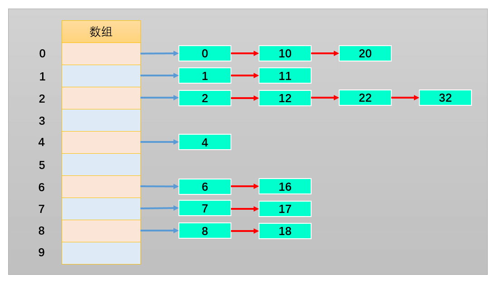

#### 开放地址法

> 开放地址法的主要工作方式是寻找空白的单元格来放置冲突的数据项。

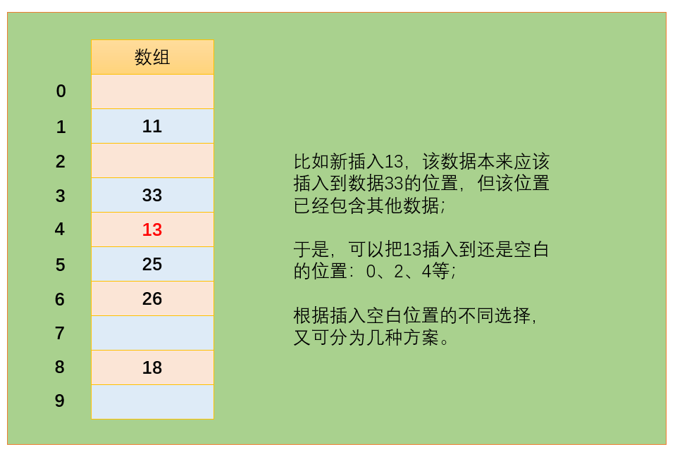

探测空白单元格也有 3 种方式（他们主要是**步长不一样**）：

**线性探测**

- 当插入 13 时：

经过哈希化（对 10 取余）之后得到的下标值 index=3，但是该位置已经放置了数据 33。而线性探测就是从 index 位置+1 开始向后一个一个来查找合适的位置来放置 13，所谓合适的位置指的是空的位置，如上图中 index=4 的位置就是合适的位置。

- 当查询 13 时：

首先 13 经过哈希化得到 index=3，如果 index=3 的位置存放的数据与需要查询的数据 13 相同，就直接返回；
不相同时，则线性查找，从 index+1 位置开始一个一个位置地查找数据 13。
查询过程中不会遍历整个哈希表，只要查询到空位置，就停止，因为插入 13 时不会跳过空位置去插入其他位置。

- 当删除 13 时：

删除操作和上述两种情况类似，但需要注意的是，删除一个数据项时，不能将该位置下标的内容设置为 null，否则会影响到之后其他的查询操作，因为一遇到为 null 的位置就会停止查找。
通常删除一个位置的数据项时，我们可以将它进行特殊处理（比如设置为-1），这样在查找时遇到-1 就知道要继续查找。

线性探测最大的问题----就是**聚集**，为了解决这个问题，我们引入二次探测

**二次探测**

对步长进行了优化，比如从下标值 x 开始探测：x+1^2^、x+2^2^、x+3^3^ 。这样一次性探测比较长的距离，避免了数据聚集带来的影响。

**再哈希法**

把关键字用另一个哈希函数，再做一次哈希化，用这次哈希化的结果作为该关键字的步长。例如：

- `stepSize = constant - （key % constant）`；
  其中 constant 是质数，且小于数组的容量；
  例如：`stepSize = 5 - （key % 5）`，满足需求，并且结果不可能为 0；

### 哈希函数

哈希表的优势在于它的速度，所以哈希函数不能采用消耗性能较高的复杂算法。提高速度的一个方法是在哈希函数中尽量减少乘法和除法。

性能高的哈希函数应具备以下两个优点：

- 快速的计算；
- 均匀的分布；

霍纳法则：在中国霍纳法则也叫做秦久韶算法，这种算法是最优选。

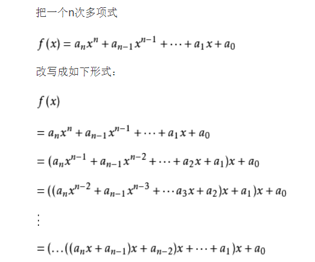

这种算法是时间复杂度只有 O(n)。下面我们来实现一个简单的哈希函数:

```js
function hashFn(str, limit) {
  const prime = 11; //自己定义一个质数
  let hashCode = 0;
  /* 秦久韶算法 */
  for (let i = 0; i < str.length; i++) {
    hashCode = hashCode * prime + str.charCodeAt(i);
  }
  return hashCode % limit;
}
```

### 哈希表的封装

首先，我将建立一个如下图的哈希表结构：


```js
export class HashTable {
  constructor() {
    this.storage = [];
    this.count = 0; /* 存放的元素个数 */
    this.limit = 11; /* 哈希表长度 */
  }
  /* 哈希函数 */
  hashFn(str, limit) {
    const prime = 11; //自己定义一个质数
    let hashCode = 0;
    /* 秦久韶算法 */
    for (let i = 0; i < str.length; i++) {
      hashCode = hashCode * prime + str.charCodeAt(i);
    }
    return hashCode % limit;
  }
}
```

接下来我们来实现一些哈希表的方法：

- **放入/修改**

> 主要思想：先获取 hashCode；然后判断该下标下 bucket 有无存值，无则创建，有则遍历该 bucket；判断是否有重复的 key，有则修改；若没有重复的 key，则直接 push [key,value] ; 最后长度增加

```js
/* 放入元素（修改） */
  put(key, value) {
    const index = this.hashFn(key, this.limit);
    let bucket = this.storage[index];
    /* 不存在就创建 */
    if (bucket === undefined) {
      bucket = [];
      this.storage[index] = bucket;
    }
    let isChange = false;
    for (let i = 0; i < bucket.length; i++) {
      let tuple = bucket[i];
      if (tuple[0] === key) {
        tuple[1] = value;
        isChange = true;
      }
    }
    if (!isChange) {
      bucket.push([key, value]);
      this.count++;
    }
  }
```

- **获取值**

> 主要思想：同上。

```js
get(key) {
    let index = this.hashFn(key, this.limit)
    let bucket = this.storage[index]
    if (!bucket) {
      return null
    } else {
      for (let i = 0; i < bucket.length; i++) {
        let tuple = bucket[i]
        if (tuple[0] === key) return tuple[1]
      }
    }
    return null
  }
```

- **删除元组**

```js
/* 删除键值对tuple */
  remove(key) {
    const index = this.hashFn(key, this.limit)
    let bucket = this.storage[index]
    if (!bucket) return false
    else {
      for (let i = 0; i < bucket.length; i++) {
        let tuple = bucket[i]
        if (tuple[0] === key) {
          bucket.splice(i, 1)
          this.count--
          return tuple[1]
        }
      }
    }
    return false
  }
```

- **是否为空** / **获取长度**

- **哈希表的扩容**

> 由于使用的是链地址法，装填因子(loadFactor)可以大于 1，所以这个哈希表可以无限制地插入新数据。但是，随着数据量的增多，storage 中每一个 index 对应的 bucket 数组（链表）就会越来越长，这就会造成哈希表效率的降低。

在 java 的源码中，当`loadFactor > 0.75`的时候会进行扩容操作

> 主要思路：首先记录下旧的哈希表，然后重置哈希表，并赋予新的 limit（哈希表长度）。然后对旧的表进行遍历，将里面的元组用 put 方法重新加入到新的表中

```js
/* 哈希表的扩容 */
  resize(newLimit) {
    const oldStorage = this.storage
    this.storage = []
    this.count = 0
    this.limit = newLimit
    for (let i = 0; i < oldStorage.length; i++) {
      let bucket = oldStorage[i]
      if (bucket) {
        for (let j = 0; j < bucket.length; j++) {
          let tuple = bucket[j]
          this.put(tuple[0], tuple[1])
          this.count++
        }
      }
    }
  }
```

为了使得扩容之后 limit 为质数，我们还需要 2 个函数：

```js
/* 质数的判断 */
  isPrime(num) {
    if (num < 1) return false
    let temp = Math.floor(Math.sqrt(num))
    for (let i = 2; i <= temp; i++) {
      if (num % i === 0) {
        return false
      }
    }
    return true
  }
  /* 获取质数 */
  getPrime(num) {
    while (!this.isPrime(num)) {
      num++
    }
    return num
  }
```

当然了，我们需要在 (**put**中) 添加元素的时候加入该功能：

```js
/* 扩容 */
if (this.count / this.limit > 0.75) {
  this.resize(this.getPrime(this.limit * 2));
}
```

除了扩容，当删除元素的时候，我们也可以进行缩容：

```js
/* 缩容 */
if (this.limit > 8 && this.count / this.limit < 0.25) {
  this.resize(this.getPrime(Math.floor(this.limit / 2)));
}
```

## 树

---

### 树结构对比于数组/链表/哈希表有哪些优势呢？

**数组：**

- 优点：可以通过下标值访问，效率高；
- 缺点：查找数据时需要先对数据进行排序，生成有序数组，才能提高查找效率；并且在插入和删除元素时，需要大量的位移操作；

**链表：**

- 优点：数据的插入和删除操作效率都很高；
- 缺点：查找效率低，需要从头开始依次查找，直到找到目标数据为止；当需要在链表中间位置插入或删除数据时，插入或删除的效率都不高。

**哈希表：**

- 优点：哈希表的插入/查询/删除效率都非常高；
- 缺点：空间利用率不高，底层使用的数组中很多单元没有被利用；并且哈希表中的元素是无序的，不能按照固定顺序遍历哈希表中的元素；而且不能快速找出哈希表中最大值或最小值这些特殊值。

**树结构**：

- 优点：树结构综合了上述三种结构的优点，同时也弥补了它们存在的缺点（虽然效率不一定都比它们高），比如树结构中数据都是有序的，查找效率高；空间利用率高；并且可以快速获取最大值和最小值等。

### 树的术语

- 树：是由 n (n≥0)的节点构成的有限集合，**n=0 时称为空树**
- 根节点：一般用 r 表示
- **子树**（SubTree）：除根节点外每个节点又可以看作是一颗子树
- **节点的度**(degree): 节点的子树的个数
- 树的度: 树中所有节点的子树中最大的个数，即最大的度
- **叶节点**: 度为 0 的节点
- 父节点、子节点和兄弟节点
- 路径和路径长度：路径为一个节点到另一个节点的通道，长度即经过的边的个数
- 节点的层次: 规定根节点所在的为第一层，依次向下递增
- 树的深度（depth）：树的最大层次

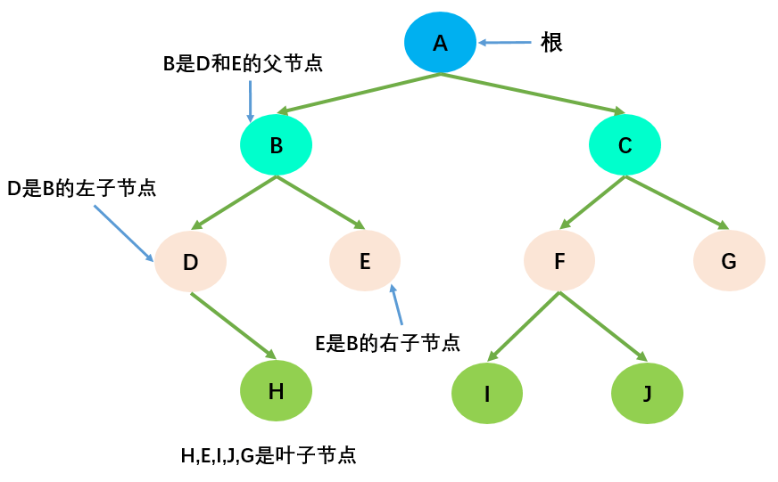

### 树的表示方法

**最普通的表示法：**

> 这种表示法最容易理解，可以直接看到节点之间的关系。但缺点是这种方法**每个节点所需要的引用是不确定的**，我们无法确定每个节点的引用数


**儿子-兄弟表示法：**

> 虽然看起来可能难以理解，但这种表示法的优点在于**每一个节点中引用的数量都是确定的**。而且将其旋转 45° 后，可以发现这是一颗二叉树。**这里统一只记录左边子节点以及右边的第一个兄弟节点**

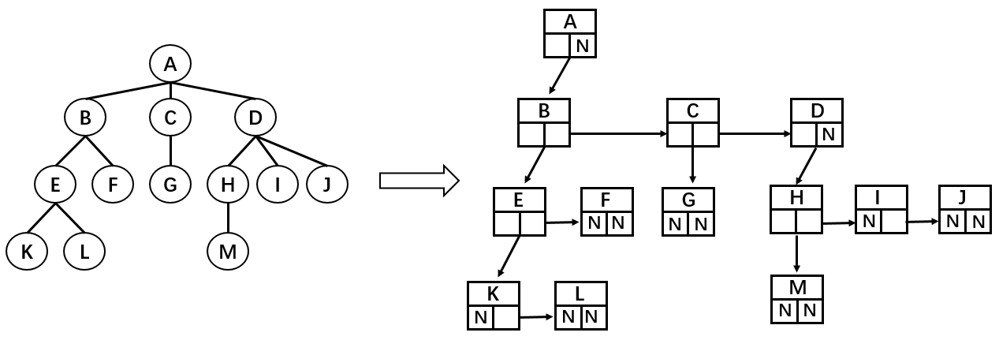

伪代码：

```js
/* 节点A */
class Node {
  constructor(data) {
    this.data = data;
    this.leftChild = E;
    this.rightChild = C;
  }
}

/* 节点B */
class Node {
  constructor(data) {
    this.data = data;
    this.leftChild = B;
    this.rightChild = null;
  }
}
```

### 二叉树

每个节点最多只有 2 度，这样的树称为二叉树。

**特性**

- 一个二叉树的第 k 层的最大节点数为：**2 ^ (k - 1)**
- 一个二叉树最大节点数为：**2 ^ k - 1**
- 对于任意非空二叉树，若 n 为叶节点的个数，n2 为度为 2 的节点个数，则满足：**n = n2 + 1**

**完美二叉树**

除最后一层外，每个节点都有 2 个子节点，这样的二叉树称为完美二叉树，或满二叉树。

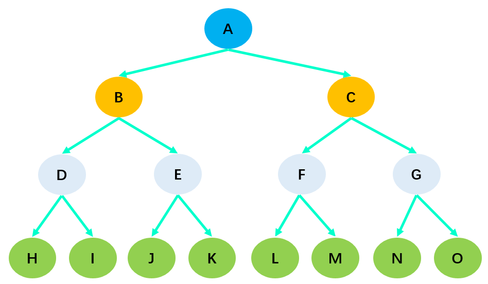

**完全二叉树**

- 除最后一层外，其他各层的节点都达到了最大值
- 最后一层从左到右的叶节点是连续存在的，可确实右边若干叶节点
- 完美二叉树是特殊的完全二叉树

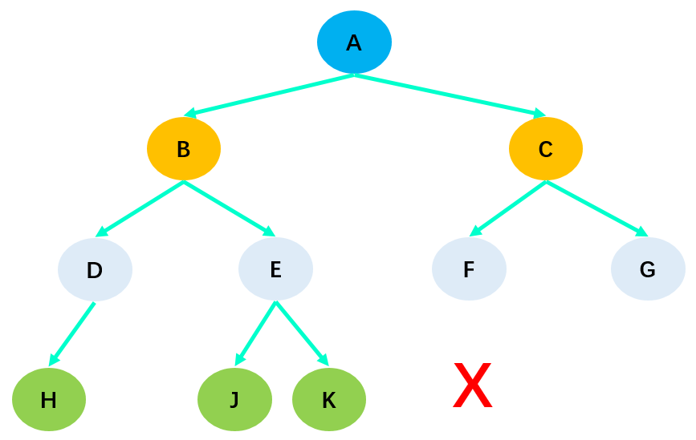

上图中的数不是完全二叉树：因为 D 的右侧子节点缺少了，导致最后一层叶节点不连续

> 二叉树一般由**链表**来存储，每个节点包含自身数据，以及左右子节点的引用。

### 搜索二叉树 (binary search tree) 及其遍历方式

二叉搜索树（BST，Binary Search Tree），也称为二叉排序树和二叉查找树。

如果不为空，则满足以下性质：

- 条件 1：非**空左子树的所有键值小于其根节点的键值。**
- 条件 2：**非空右子树的所有键值大于其根节点的键值；**
- 条件 3：左、右子树本身也都是二叉搜索树；

二叉搜索树的搜索效率非常高，其原理是 **二分查找** 。


**代码实现：**

_Node 节点类：_

```js
class Node {
  constructor(key) {
    this.key = key;
    this.left = null;
    this.right = null;
  }
}
```

_BinarySearchTree 类：_

```js
class BinarySearchTree {
  constructor() {
    this.root = null;
  }
}
```

_方法：_

- **插入操作：**

> 这里的插入操作思路，首先得判断是否为空树，然后依次比较节点与插入节点值的大小，然后进行左右节点的再比较。
> 因为节点的每一个节点也是一个子树，所以我用了递归算法。

```js
/* 递归操作 */
 recursionInsert(node, newNode) {
    if (node.key < newNode.key) {
      if (!node.right) {
        node.right = newNode
      } else {
        this.recursionInsert(node.right, newNode)
      }
    } else {
      if (!node.left) {
        node.left = newNode
      } else {
        this.recursionInsert(node.left, newNode)
      }
    }
  }
  /* 插入操作 */
  insert(key) {
    let newNode = new Node(key)
    if (this.root === null) {
      this.root = newNode
    } else {
      this.recursionInsert(this.root, newNode)
    }
  }
```

- **树的遍历**

所有的二叉树都有 3 种遍历方式：

- 先序遍历
- 中序遍历
- 后序遍历

> 以遍历根（父）节点的顺序来区分三种遍历方式。比如：先序遍历先遍历根节点、中序遍历第二遍历根节点、后续遍历最后遍历根节点。

- **先序遍历**

**从根节点开始，先遍历所有左子树，后遍历右子树**

> 代码思路：从根节点开始，通过递归不断遍历左子树，直至空节点时，返回至上一次递归，执行遍历右子树，直至空节点时，返回至上一次递归。上一次递归左右都遍历完之后，再返回上上次递归，依次类推，直至最开始的递归完成。

```js
/* 先序遍历 */
  preOrderTraverse() {
    let result = []
    this.recursionPreOrder(this.root, result)
    return result
  }
  recursionPreOrder(node, res) {
    if (node === null) return res
    res.push(node.key)
    this.recursionPreOrder(node.left, res)
    this.recursionPreOrder(node.right, res)
  }
```

- **中序遍历**

**先遍历左子树，再遍历其父节点，后遍历右子树**

> 代码思路：将访问数据的步骤放在遍历左子树之后，打印出来的是**顺序序列**

```js
/* 中序遍历 */
  midOrderTraverse() {
    let result = []
    this.recursionMidOrder(this.root, result)
    return result
  }
  recursionMidOrder(node, res) {
    if (node === null) return res
    this.recursionMidOrder(node.left, res)
    res.push(node.key)
    this.recursionMidOrder(node.right, res)
  }
```


- **后序遍历**

**从最底层左子树开始，先遍历左子树，后遍历右子树，再遍历它们的父节点**

> 代码思路：将访问数据的步骤放在遍历完左、右子树之后

```js
/* 后序遍历 */
postOrderTraverse() {
let result = []
this.recursionPostOrder(this.root, result)
return result
}
recursionPostOrder(node, res) {
if (node === null) return res
this.recursionPostOrder(node.left, res)
this.recursionPostOrder(node.right, res)
res.push(node.key)
}
```


- **树的最小值和最大值**

由于搜索二叉树的特性，我们很容易就可以知道，最小值和最大值分别位于树的最深层的最左端和最右端。因此我们之前通过循环一直遍历左边或右边即可

```js
/* 最小值与最大值 */
  min() {
    if (this.root === null) return null
    let node = this.root
    while (node.left) {
      node = node.left
    }
    return node.key
  }
  max() {
    if (this.root === null) return null
    let node = this.root
    while (node.right) {
      node = node.right
    }
    return node.key
  }
```

- **搜索特定值**

> 利用递归，不断比较节点值与特定值的大小，然后在其左子树或右子树里面去寻找

```js
search(key) {
    return this.recursionSearch(this.root, key)
  }
  recursionSearch(node, key) {
    if (node === null) return false
    if (key > node.key) {
      return this.recursionSearch(node.right, key)
    } else if (key < node.key) {
      return this.recursionSearch(node.left, key)
    } else {
      return true
    }
  }
```

- **删除节点**

这个删除操作是最为复杂的一个操作。下面我们先放代码：

```js
/* 删除操作（最复杂） */
  remove(key) {
    /* 先找到需要删除的节点以及其父节点 */
    let current = this.root
    let parent = null
    let isLeft = false
    while (current.key !== key) {
      parent = current
      if (current.key < key) {
        isLeft = false
        current = current.right
      } else {
        isLeft = true
        current = current.left
      }
    }
    if (current === null) return false
    /* 开始执行删除操作 */
    /* 第一种情况：删除节点为叶节点 */
    if (current.left === null && current.right === null) {
      if (current === this.root) {
        this.root = null
      } else if (isLeft) {
        parent.left = null
      } else {
        parent.right = null
      }
    } else if (current.right === null) {
      /* 第二种情况： 删除节点的度为1 */
      if (current === this.root) {
        this.root = current.left
      } else if (isLeft) {
        parent.left = current.left
      } else {
        parent.right = current.left
      }
    } else if (current.left === null) {
      if (current === this.root) {
        this.root = current.left
      } else if (isLeft) {
        parent.left = current.right
      } else {
        parent.right = current.right
      }
    } else {
      /* 第三种情况：删除节点的度为2，这里只找后继 */
      let successor = this.getSuccessor(current)
      if (this.root === current) {
        this.root = successor
      } else if (isLeft) {
        parent.left = successor
      } else {
        parent.right = successor
      }
      successor.left = current.left
    }
    return current
  }
  /* 寻找后继 */
  getSuccessor(delnode) {
    let successor = delnode.right
    let successorParent = delnode
    while (successor.left) {
      successorParent = successor
      successor = successor.left
    }
    /* 如果是的话，就只需要将delnode替换成successor就可以了，不需要以下操作 */
    if (successor !== delnode.right) {
      successorParent.left = successor.right
      successor.right = delnode.right
    }
    return successor
  }
```

**思路分析**

> 首先先通过遍历找到符合的节点
> 下面分**三种情况**进行删除操作：
>
> 1. 当删除节点为叶节点的时候，首先判断为根节点的时候，直接删除根节点；然后直接根据 isLeft 通过删除 parent 的指针来删除该节点。
> 2. 当删除节点的度为 1 时，首先判断为根节点的时候，直接将根节点指向其子节点；然后将 parent 的指针直接指向删除节点的下一个节点
> 3. 当删除节点的度为 2 时，我们首先要知道一件事情，就是删除节点后，应该用哪个节点来代替呢？其实答案就是，current 左子树中比 current 小一点点的节点，即 current 左子树中的最大值，称为**前驱**；
>    current 右子树中比 current 大一点点的节点，即 current 右子树中的最小值，称为**后继**；我们上述代码就是考虑后继的情况。那么首先封装一个函数 getSuccessor 来获取后继节点。我们要考虑一种特殊情况：当后继是删除节点的右子节点时，就类似上述情况一样，将 parent 的指针直接指向删除节点的右子节点(即后继),这是一种通用的步骤，所以我把它放在了 successor 函数之外。除此之外，我们可以在 successor 函数内部，进行下图中 ① ② 的操作，最后根据 isLeft 链接 parent 指针，即 ③ 操作步骤


### 平衡树

二叉搜索树的优势我们已经了解了，但是它也有它的缺陷：当插入的数据是有序的数据，就会造成二叉搜索树的深度过大。比如原二叉搜索树由 11 7 15 组成，当插入一组有序数据：6 5 4 3 2 就会变成深度过大的搜索二叉树，会严重影响二叉搜索树的性能。


比较好的二叉搜索树，它的数据应该是左右均匀分布的。但是插入连续数据后，二叉搜索树中的数据分布就变得不均匀了，我们称这种树为非平衡树。对于一棵平衡二叉树来说，插入/查找等操作的效率是 O(log n)。而对于一棵非平衡二叉树来说，相当于编写了一个链表，查找效率变成了 O(n)。

对于平衡树的话，我们操作的效率应该是接近于 O(log n)的，而且每个节点的左右子树的节点都应该尽可能相等。

**常见的平衡树：**

- **AVL 树**：是最早的一种平衡树，它通过在每个节点多存储一个额外的数据来保持树的平衡。由于 AVL 树是平衡树，所以它的时间复杂度也是 O(log n)。但是它的整体效率不如红黑树，开发中比较少用。
- **红黑树**：同样通过一些特性来保持树的平衡，时间复杂度也是 O(log n)。进行插入/删除等操作时，性能优于 AVL 树，所以平衡树的应用基本都是红黑树。

#### 红黑树

红黑树是特化的 BST，对于任何的红黑树，我们有以下规则：

- 性质 1. 结点是红色或黑色。
- 性质 2. 根结点是黑色。
- 性质 3. 所有叶子都是黑色。（叶子是 NIL 结点）
- 性质 4. 每个红色结点的两个子结点都是黑色。（**从每个叶子到根的所有路径上不能有两个连续的红色结点**）
- 性质 5. 从任一节结点其每个叶子的所有路径都包含相同数目的黑色结点。

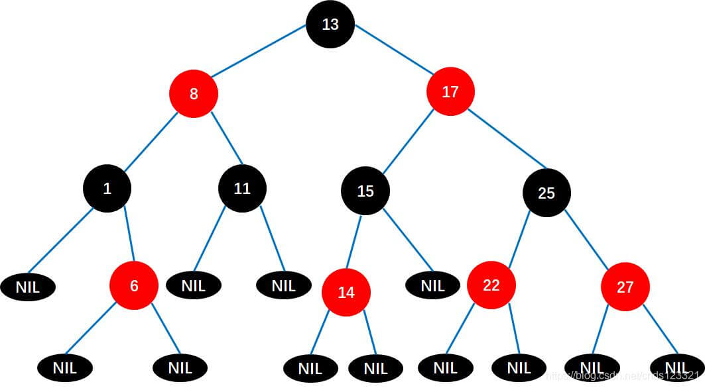

> 前面的规则保证了红黑树的基本平衡以及其高效性。
> **从根到叶子的最长可能路径不会超过最短可能路径的两倍。**
> 依据前面的规则，我们可以知道最短可能路径应该是经过的节点都是黑色节点的，最长可能路径是红黑相间的。

##### 红黑树的变换

当插入一个新节点的时候，可能导致红黑树不再平衡，为了去调整平衡性，我们通过变色、左旋转和右旋转三种方式的变换来维持平衡

- **变色**

顾名思义，是将若干个节点在红、黑色之间变换，来实现红黑树的平衡以及遵守其规则。

我们在插入节点的时候，规定插入节点为红色。因为如果是黑色的话，插入后必然违反第 5 条规则。如果是红色的话，就有可能不做任何变换就可以使得树平衡。如下面的例子（插入一个 14 号节点）：


- **左旋转和右旋转**


如上图，左旋转即逆时针，右旋转即顺时针。我以右旋转为例子：

- E M 子树 3 顺时针旋转，则 E 为父节点，M 为子节点，而子树 3 变成了（右）孙子节点，同时原本 E 下面的右子节点向右平移变成了 M 的左子节点。

下面我们通过这 3 种变换，来总结出红黑树的 5 种变形规则：

**变形规则**

1. 当插入一个空树的时候，我们将一个红色新节点插入，然后变色。

2. 当父节点是黑色节点的时候，直接将红色新节点插入即可。

3. 当父节点是红色，叔叔节点是红色而爷爷为黑色，这时候红色新节点插入后，同时将父节点、叔叔以及爷爷变色即可。


4. 当父节点是红色，叔叔节点和爷爷是黑色，且插入位置在左边的时候，这时候我们要将父和爷爷节点变色，然后进行一个右旋转。


5. 当父节点是红色，叔叔节点和爷爷是黑色，且插入位置在右边的时候，这时候将以父节点为轴进行左旋转，这时候就跟情况 4 一样了。


说了这么多，我们来实现一下红黑树中插入节点的代码吧！

首先是红黑树的节点，比普通的二叉树多了颜色属性：

**Node 节点类：**

```js
const RED = true;
const BLACK = false;
class Node {
  constructor(key) {
    this.key = key;
    this.left = null;
    this.right = null;
    this.color = RED;
    this.flipColor = function () {
      if (this.color === RED) {
        this.color = BLACK;
      } else {
        this.color = RED;
      }
    };
  }
}
```

**红黑树：**

```js
class RBT {
  constructor() {
    this.root = null;
    this.size = 0;
  }
  /* 左旋转： */
  rotateLeft(Father) {
    let rightSon = Father.right;
    Father.right = rightSon.left;
    rightSon.left = Father;
    rightSon.color = Father.color;
    Father.color = RED;
  }
  /* 右旋转： */
  rotateRight(Father) {
    let leftSon = Father.left;
    Father.left = leftSon.right;
    leftSon.right = Father;
    leftSon.color = Father.color;
    Father.color = RED;
  }
  // 颜色翻转
  flipColors(node) {
    node.color = RED;
    node.left.color = BLACK;
    node.right.color = BLACK;
  }
  /* 插入节点 */
  add(key) {
    this.root = this.addRoot(this.root, key);
    this.root.color = BLACK; // 根节点始终是黑色
  }
  addRoot(node, key) {
    if (!node) {
      this.size++;
      return new BRNode(key);
    }
    if (key < node.key) {
      node.left = this.addRoot(node.left, key);
    } else if (key > node.key) {
      node.right = this.addRoot(node.right, key);
    } else {
      node.key = key;
    }
    /* 情况5 */
    if (this.isRed(node.right) && !this.isRed(node.left)) {
      node = this.rotateLeft(node);
      /* node就等于新节点即旋转上来的节点（新的父节点） */
    }
    /* 情况4 */
    if (this.isRed(node.left) && this.isRed(node.left.left)) {
      node = this.rotateRight(node);
    }
    /* 情况3 */
    if (
      this.isRed(node.right) &&
      this.isRed(node.left) &&
      (this.isRed(node.left.left) || this.isRed(node.right.right))
    ) {
      this.flipColors(node);
    }
    return node;
  }
}
```

> 这里的代码有点 BUG。实在是写不出来了哈哈~

## 最大(最小堆)

最大(最小堆)，也是一颗**完全二叉树**，最大堆：父结点的键值总是大于或等于任何一个子节点的键值；最小堆：父结点的键值总是小于或等于任何一个子节点的键值。在最大堆中任意子堆都满足父结点的键值总是大于或等于任何一个子节点的键值这一性质。如下图即为一个最大堆。


下面我使用数组来实现一个最大堆。

假设当前索引为`i`，那么有三个公式非常重要：

- 当前节点的父节点为 `i - 1 >> 1`
- 当前节点的左子节点为 `(i << 1) + 1`
- 当前节点的右子节点为 `(i << 1) + 2`

因此可实现以上三个方法：

```js
function _parent(index) {
  return (index - 1) >> 1;
}
function _child_left(index) {
  return (index << 1) + 1;
}
function _child_right(index) {
  return (index << 1) + 2;
}
```

敲重点了：最重要的插入以及删除节点的两个方法：

### siftUp 添加节点

步骤：

1. 往数组末尾添加节点
2. 添加后不满足最大堆性质，则递归向父节点比较大小并交换。
3. 直到当前节点已经是根节点为止或者已经满足最大堆性质

```js
  offer(value) {
    this.data.push(value)
    this._siftUp(this.size++)
  }
  _siftUp(index) {
    // compare方法即 比较大小：这里最大堆是 (a,b)=>a>b
    while (this._parent(index) >= 0
        && this.compare(this.data[index], this.data[this._parent(index)])) {
        this._swap(index, this._parent(index))
        index = this._parent(index)
    }
  }
```

### siftDown 删除节点

这里的删除节点是删除根节点。步骤是：

1. 首先将根节点和末尾节点交换位置。
2. 然后将现在的根节点递归地与其子节点中较大的那个比较大小且交换位置
3. 直至到叶子节点或者已经满足最大堆性质

```js
 poll() {
        this._swap(0, --this.size)
        this._siftDown(0)
        return this.data.pop()
 }
_siftDown(index) {
  while(this._child(index) < this.size) {
    let child = this._child(index)
    if(child + 1 < this.size
      && this.compare(this.data[child + 1], this.data[child])) {
        child = child + 1
    }
    if(this.compare(this.data[index], this.data[child])){
      break
    }
    this._swap(index, child)
    index = child
  }
}
```

> 订正：以下是之前的代码，这里有一个问题不知道有人能看出来吗？这里没有判断 \_child(index)+1 有没有超出 size

```js
 poll() {
        this._swap(0, --this.size)
        this._siftDown(0)
        return this.data.pop()
 }
  _siftDown(index) {
    while (this._child(index) < this.size
        && this.compare(this.data[this._child(index)], this.data[index])
    ) {
        let child = this.data[this._child(index)] > this.data[this._child(index) + 1]
            ? this._child(index) : this._child(index) + 1
        this._swap(child, index)
        index = child
    }
}
```

### 完整代码如下：

```js
class PriorityQueue {
  constructor(compare = (a, b) => a > b) {
    this.data = [];
    this.size = 0;
    this.compare = compare;
  }
  peek() {
    return this.size > 0 ? this.data[0] : null;
  }
  offer(value) {
    this.data.push(value);
    this._siftUp(this.size++);
  }
  poll() {
    this._swap(0, --this.size);
    this._siftDown(0);
    return this.data.pop();
  }
  _parent(index) {
    return (index - 1) >> 1;
  }
  _child(index) {
    return (index << 1) + 1;
  }
  _siftUp(index) {
    while (
      this._parent(index) >= 0 &&
      this.compare(this.data[index], this.data[this._parent(index)])
    ) {
      this._swap(index, this._parent(index));
      index = this._parent(index);
    }
  }
  _siftDown(index) {
    while (this._child(index) < this.size) {
      let child = this._child(index);
      if (
        child + 1 < this.size &&
        this.compare(this.data[child + 1], this.data[child])
      ) {
        child = child + 1;
      }
      if (this.compare(this.data[index], this.data[child])) {
        break;
      }
      this._swap(index, child);
      index = child;
    }
  }
  _swap(a, b) {
    [this.data[a], this.data[b]] = [this.data[b], this.data[a]];
  }
}
```

## 图 Graph

---

图是由顶点的有穷非空集合和顶点之间边的集合构成的一种结构。它不像线性表和树的数据元素有着明显的关系一样，图的数据元素是可以杂乱无章的，是多对多的。


**注意，图是不能为空的，不允许没有顶点**

### 图的术语

- **顶点 Vertex**：图中的一个个数据元素。
- **边** ：顶点之间的关系。
- **有向图\*\***和无向图\*\*：


其中，有向图中，A->D 就是一条**有向边**，称作**弧**，我们可以用`<A,D>`来表示，A D 顺序不能换；无向边的话，我们可以用`(A,D)`或者`(D,A)`来表示

- **简单图**：不存在顶点到自身的边，且同一条边不会重复出现。
- **无向完全图**：无向图中任意两点之间都存在边。此时边的数量一共是 `n(n-1)/2`
  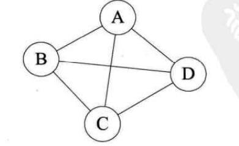

- **有向完全图**: 有向图中任意两点间都存在正反的两条弧。此时边数量为 `n(n-1)`

- 稀疏图和稠密图

- **权**
  在图中，我们考虑实际情况，每条边的距离或者耗费都是不一样的，我们给每条边一个相关数，称为**权**。带权图我们称为 **网**。

- 子图

- **度**：我们可以类比树，即一个顶点通过边相连其他顶点的数量。度分为**入度**以及**出度**。
- 路径。**回路**：第一个顶点与最后一个顶点相同的路径称为回路。

### 图的表示方法

- **邻接矩阵**


我们用一个二维数组来表示图结构，0 代表无边，1 代表有边，这里是一个无向图，所以矩阵关于主对角线对称。对于带权图，我们可以把 1 换成权重。

> 邻接矩阵最大的问题，就是如果是一个稀疏图的话，就会有很多的 0，浪费很多内存空间

- **邻接表**
  

这里跟哈希表很相似。对于带权图，我们可以在每个表结点处增加一个权重的数据。

> 我们很容易的就可以获取每个顶点的出度，但是要获取入度的话就非常困难了。为此我们可以用逆邻接表。

那么下面我们以邻接表的形式用代码实现一下图结构 (以无向图为例子,下面的字典是上述我实现过的结构，用于存储键值对)：

```js
export default class Graph {
    constructor() {
        this.vertexes = []    // 存储顶点
        this.adjList = new Dictionay()   //存储边信息
    }
    // 添加顶点
    addVertex(val) {
        this.vertexes.push(val)
        this.adjList.set(val, [])
    }

    // 添加边
    addEdge(val1, val2) {
        /* 无向图 */
        this.adjList.get(val1).push(val2)
        this.adjList.get(val2).push(val1)
    }

    // 输出图结构
    toString() {
        let str = ''
        for (let i = 0; i < this.vertexes.length; i++) {
            str += this.vertexes[i] + '-->'
            let edges = this.adjList.get(this.vertexes[i])
            for (let j = 0; j < edges.length; j++) {
                str += edges[j] + ' '
            }
            str += '\n'
        }
        return str
    }
```

### 图的遍历

这里我们来讲 2 个非常非常重要的图的遍历方法。

- 广度优先搜索 (Breadth-first Search)
- 深度优先搜索 (Depth-first Search)

#### 广度优先搜索

顾名思义，就是先往一个顶点的周围顶点进行搜索，再搜索周围顶点的周围顶点。可能说的比较绕口，我们以下面的例子来看看：

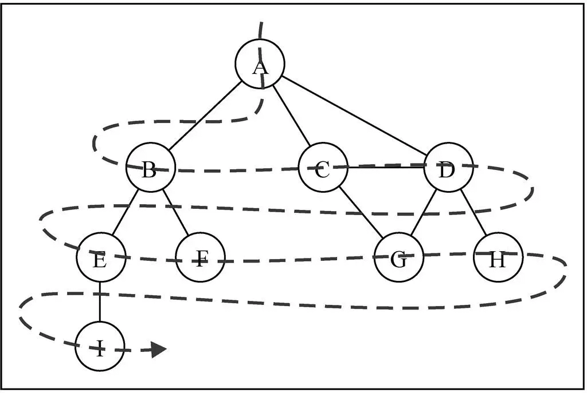

那么代码实现又如何呢？我们可以利用队列来实现，如下面的例子：


**代码实现**

```js
// 初始化顶点的颜色
_initialize() {
    let visits = []
    for (let i = 0; i < this.vertexes.length; i++) {
        visits[this.vertexes[i]] = false
    }
    return visits
}

// 广度优先搜索
bfs(v, handle) {
    /* 初始化 */
    let visits = this._initialize()
    let queue = new Queue()
    queue.enqueue(v)
    /* 加入队列中即变成灰色 */
    visits[v] = true
    while (!queue.isEmpty()) {
        let vertex = queue.dequeue()
        let borders = this.adjList.get(vertex)
        /* 取相邻顶点加入到队列中 */
        for (let i = 0; i < borders.length; i++) {
            let b = borders[i]
            /* 判断之前有没有加入过 */
            if (visits[b] === false) {
                visits[b] = true
                queue.enqueue(b)
            }
        }
        /* 访问取出的节点 */
        handle(vertex)
    }
}
```

#### 深度优先搜索

深度优先搜索的话，非常类似二叉树中的先序遍历。因此我们还是使用递归进行遍历。

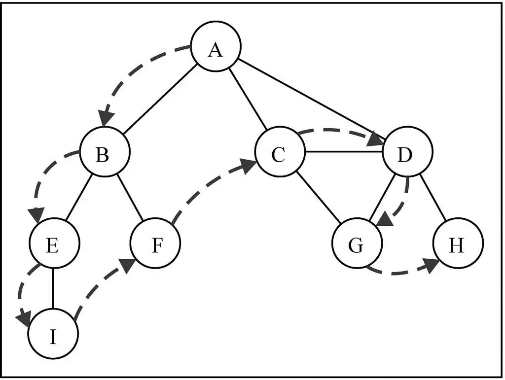

**代码实现：**

```js
// 深度优先搜索
dfs(v, handle) {
    let visits = this._initialize()
    this._dfsVisit(v, visits, handle)
}
// dfs的递归方法  这里直接使用函数的调用栈
_dfsVisit(v, visits, handle) {
    handle(v) //访问 v
    visits[v] = true
    let borders = this.adjList.get(v)
    for (let i = 0; i < borders.length; i++) {
        let b = borders[i]
        /* 判断之前有没有加入过 */
        if (visits[b] === false) {
            this._dfsVisit(b, visits, handle)
        }
    }
}
```

## 排序算法

---

### 冒泡排序

通过遍历，比较两两之间的大小，逐次把最大值都移到最后面，从而得到顺序。冒泡排序的时间复杂度是 **O(n^2)**

```js
function bubbleSort(arr) {
  for (let j = arr.length - 1; j >= 0; j--) {
    for (let i = 0; i < j; i++) {
      if (arr[i] > arr[i + 1]) {
        let temp = arr[i + 1];
        arr[i + 1] = arr[i];
        arr[i] = temp;
      }
    }
  }
  return arr;
}
```

### 选择排序

顾名思义，逐次遍历数组找到最小值(或者最大值)然后放到最前面(最后面)。选择排序的时间复杂度是 **O(n^2)**，但是交换次数优化到了 O(n)

```js
function seletionSort(arr) {
  for (let j = 0; j < arr.length - 1; j++) {
    let min = j;
    for (let i = j + 1; i < arr.length; i++) {
      if (arr[min] > arr[i]) {
        min = i;
      }
    }
    let temp = arr[j];
    arr[j] = arr[min];
    arr[min] = temp;
  }
  return arr;
}
```

### 插入排序

插入排序具体过程：取出并标记任一位元素，认为其左边的数据是**局部有序**，然后依次对左边数据进行比较，直至找到合适的位置。以此类推。

```js
function insertionSort(arr) {
  for (let i = 1; i < arr.length; i++) {
    /* 取出标记元素 */
    let temp = arr[i];
    let j = i;
    /* 若左边数据大于标记元素数据，则右移 */
    while (arr[j - 1] > temp && j > 0) {
      arr[j] = arr[j - 1];
      j--;
    }
    /* 找到合适的位置则放进去 */
    arr[j] = temp;
  }
  return arr;
}
```

> 插入排序的效率是以上三种最好的，它们比较以及换位置的最差情况次数都是 n(n-1)/2，即平均次数都是 n(n-1)/4。但是时间复杂度都是 O(n^2)。接下来我们来学习突破 O(n^2)复杂度的更好的排序算法吧！

### 希尔排序

希尔排序的算法是这样的：首先按照一定的间隔(增量)将数据分成若干组，然后组内进行插入排序。然后将间隔数缩小，重复操作，直至间隔为 1 的插入排序。

一般的初次取序列的一半为增量，以后每次减半，直到增量为 1。

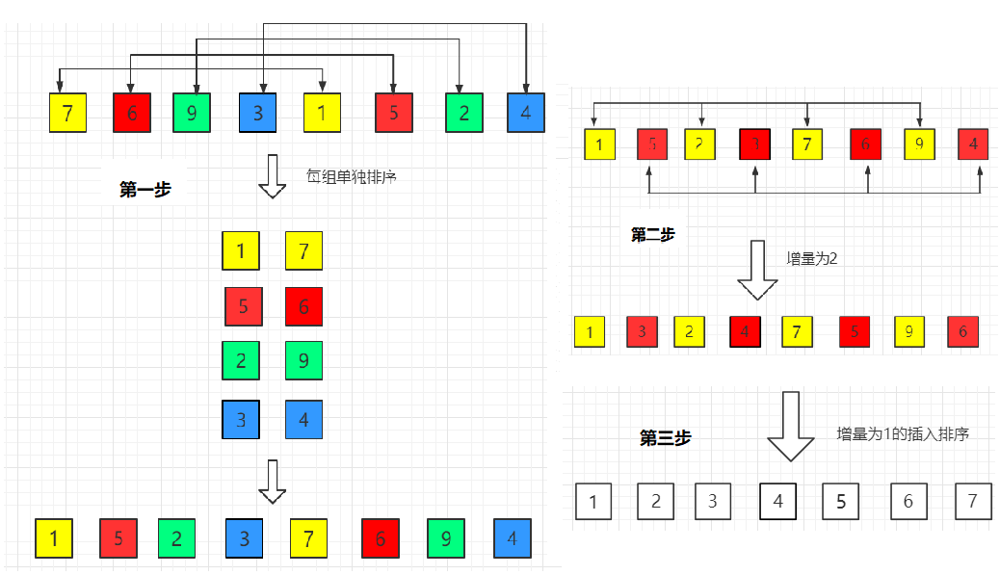

**代码实现：**

```js
function shellSort(arr) {
  let length = arr.length;
  let gap = Math.floor(length / 2);
  /* 第一层循环，增量的缩小 */
  while (gap >= 1) {
    /* 第二层循环插入排序：取出标记元素 */
    for (let i = gap; i < length; i++) {
      let temp = arr[i];
      let j = i;
      /* 第三层循环插入排序：比较大小 */
      while (arr[j - gap] > temp && j > gap - 1) {
        arr[j] = arr[j - gap];
        j -= gap;
      }
      arr[j] = temp;
    }
    gap = Math.floor(gap / 2);
  }
  return arr;
}
```

希尔排序根据增量选取的不同，时间复杂度也会不一样，并且其时间复杂度非常难以计算。但是以上述的这种做法，其时间复杂度必然小于 O(n^2),
突破了以前认为排序算法不可能突破 O(n^2)的思维束缚。

### 快速排序

快速排序几乎是所有排序算法中，最快速的，最好的算法了。它被称为 20 世纪十大算法之一，其平均时间复杂度可达到 O(n\*logn)。
其思路是：首先选择一个中枢数据，然后将其他所有小于中枢的数据排在左边，所有大于中枢的数据排在后边，然后分而治之，再对左右两边的数据进行同样的操作，以此类推。

比较简单的实现代码如下：

```js
function quickSort(arr) {
  const cur = function (arr) {
    if (arr.length <= 1) return arr;
    let pivot = arr[0];
    let left = [];
    let right = [];
    for (let i = 1; i < arr.length; i++) {
      if (arr[i] < pivot) left.push(arr[i]);
      else right.push(arr[i]);
    }
    return [...cur(left), pivot, ...cur(right)];
  };
  return cur(arr);
}
```

或者选择一个中枢数据为尾元素：

```js
const quickSort = (array) => {
  const sort = (arr, left = 0, right = arr.length - 1) => {
    if (left >= right) {
      return;
    }
    let i = left;
    let j = right;
    const baseVal = arr[j]; // 取无序数组最后一个数为基准值
    while (i < j) {
      //把所有比基准值小的数放在左边大的数放在右边
      while (i < j && arr[i] <= baseVal) {
        //找到一个比基准值大的数交换
        i++;
      }
      arr[j] = arr[i]; // 将较大的值放在右边如果没有比基准值大的数就是将自己赋值给自己（i 等于 j）
      while (j > i && arr[j] >= baseVal) {
        //找到一个比基准值小的数交换
        j--;
      }
      arr[i] = arr[j]; // 将较小的值放在左边如果没有找到比基准值小的数就是将自己赋值给自己（i 等于 j）
    }
    arr[j] = baseVal; // 将基准值放至中央位置完成一次循环（这时候 j 等于 i ）
    sort(arr, left, j - 1);
    sort(arr, j + 1, right);
  };
  const newArr = array.concat();
  sort(newArr);
  return newArr;
};
```

那么应该怎么选择中枢会让快速排序的效率最高呢？一般用数据的头尾中 3 个数据中的中位数作为中枢数据。

```js
function getPivot(arr, left, right) {
  let center = Math.floor((left + right) / 2);
  /* 然后这3个数据进行一个排序，最后把中枢放在倒数第二位 */
  if (arr[left] > arr[center]) {
    let temp = arr[left];
    arr[left] = arr[center];
    arr[center] = temp;
  }
  if (arr[left] > arr[right]) {
    let temp = arr[left];
    arr[left] = arr[right];
    arr[right] = temp;
  }
  if (arr[center] > arr[right]) {
    let temp = arr[center];
    arr[center] = arr[right];
    arr[right] = temp;
  }
  let t = arr[center];
  arr[center] = arr[right - 1];
  arr[right - 1] = t;
  return arr[right - 1];
}
/* 主函数 */
function quickSort(arr) {
  quick(arr, 0, arr.length - 1);
  return arr;
}
function quick(arr, left, right) {
  /* 结束条件 */
  if (left >= right) return;
  let pivot = getPivot(arr, left, right);
  /* 记录左右指针的位置 */
  let i = left;
  let j = right - 1;
  while (i < j) {
    while (arr[++i] < pivot) {}
    while (arr[--j] > pivot) {}
    if (i < j) {
      let temp = arr[i];
      arr[i] = arr[j];
      arr[j] = temp;
    }
  }
  /* 将大的数和中枢交换位置 ,即现在中枢的位置是正确的：i*/
  let t = arr[i];
  arr[i] = arr[right - 1];
  arr[right - 1] = t;
  /* 分而治之 */
  quick(arr, left, i - 1);
  quick(arr, i + 1, right);
}
```

原理图如下：
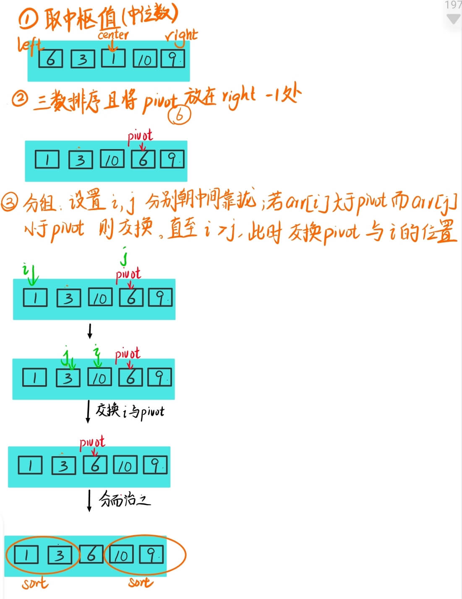

### 基数排序


```js
function maxBits(num) {
  let ans = 0;
  while (num > 0) {
    num = Math.floor(num / 10);
    ans++;
  }
  return ans;
}
function getDigit(num, d) {
  return Math.floor(num / Math.pow(10, d - 1)) % 10;
}
// 下面的代码优化得与算法思路不一样：这里出桶相当于从后往前遍历原数组
function sort(arr) {
  const digit = maxBits(Math.max(...arr));
  const n = arr.length;
  let bucket = new Array(n);
  for (let d = 1; d <= digit; d++) {
    let cnt = new Array(10).fill(0);
    // 计数并且改造成前缀和形式
    for (let i = 0; i < n; i++) {
      let j = getDigit(arr[i], d);
      cnt[j]++;
    }
    for (let i = 1; i < 10; i++) {
      cnt[i] = cnt[i - 1] + cnt[i];
    }
    for (let i = n - 1; i >= 0; i--) {
      let j = getDigit(arr[i], d);
      bucket[cnt[j]-- - 1] = arr[i];
    }
    for (let i = 0, j = 0; i < n; i++, j++) {
      arr[i] = bucket[j];
    }
  }
  return arr;
}

console.log(sort([1, 9, 8, 7, 5, 6]));
```

## Manacher 算法

Manacher 算法是专门用于解决回文子串问题的优质算法。一般对于求解一个字符串的最长回文子串问题，如果使用通常解法的话：

**通常解法**一般是遍历字符串，从每一个字符向左右同时外扩，这样的时间复杂度一般在 O(n^2)，而且这种做法对偶数的回文子串没有作用。

因此我们可以加一个占位符，这样的话就可以同时解决奇数偶数回文子串的问题。

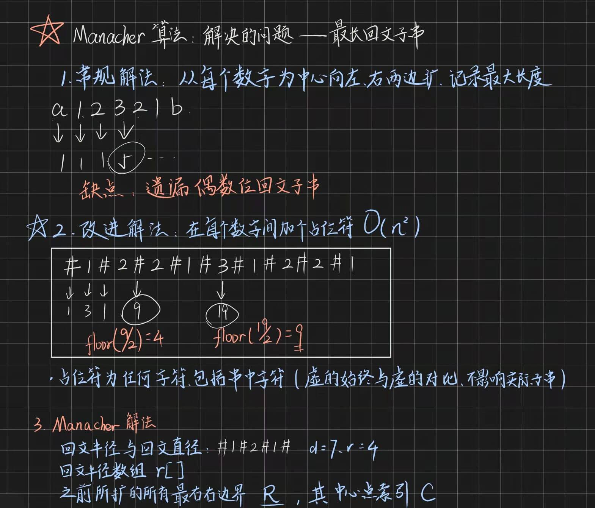

有了上面思维作基础，我们就可以开始讲一下 Manacher 算法了：

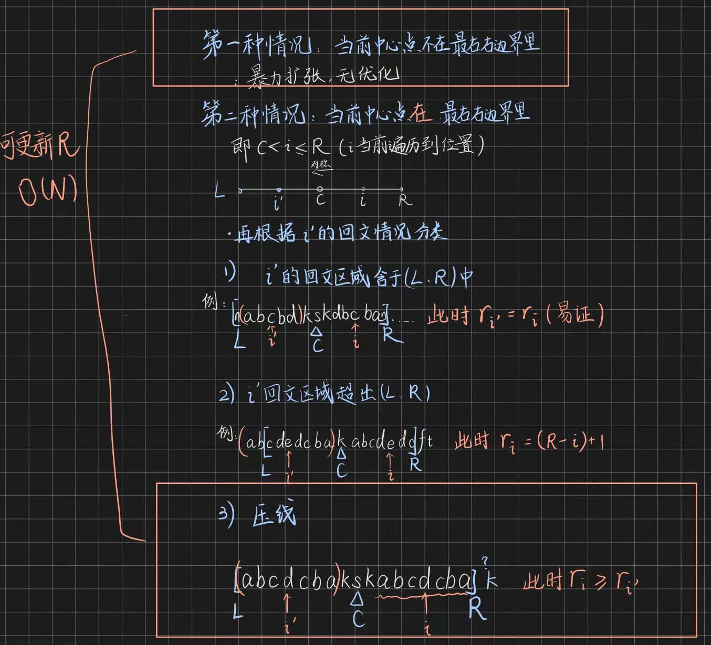

```js
function manacherStr(s) {
  let n = s.length * 2 + 1;
  let ans = new Array(n);
  let index = 0;
  for (let i = 0; i < n; i++) {
    ans[i] = i & 1 ? s.charAt(index++) : "#";
  }
  return ans;
}
// console.log(manacherStr('123'));
function manacher(str) {
  if (!str || str.length === 0) return 0;
  const s = manacherStr(str);
  const n = s.length;
  let PR = new Array(n); // 回文半径数组
  let C = (R = -1); // 这里的R是有效范围有界+1
  let max = -Infinity;
  for (let i = 0; i < n; i++) {
    PR[i] = R > i ? Math.min(PR[C * 2 - i], R - i) : 1; // 不用验证的初始半径
    while (i - PR[i] >= 0 && i + PR[i] < n) {
      if (s[i - PR[i]] === s[i + PR[i]]) {
        PR[i]++;
      } else break;
    }

    if (i + PR[i] > R) {
      R = i + PR[i];
      C = i;
    }
    max = Math.max(max, PR[i]);
  }
  return max - 1;
}
```

## KMP 算法

KMP 算法用来解决寻找子串的问题的。（相当于 indexof）

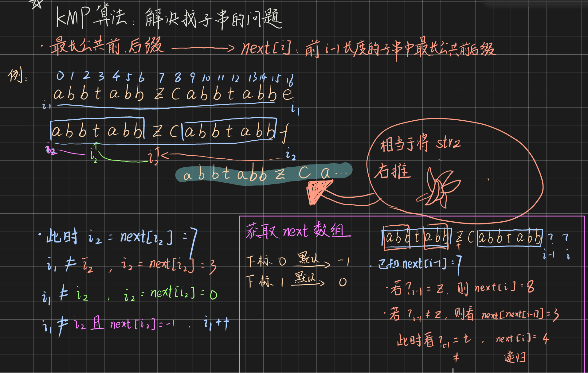

```js
/**
 * @param {string} haystack
 * @param {string} needle
 * @return {number}
 */
function strStr(s, m) {
  if (s === null || m === null || s.length < m.length) return -1;
  if (m.length === 0) return 0;
  let str1 = s.split("");
  let str2 = m.split("");
  let next = getNextArr(m);
  let i1 = 0;
  let i2 = 0;
  while (i1 < str1.length && i2 < str2.length) {
    if (str1[i1] === str2[i2]) {
      i1++;
      i2++;
    } else if (next[i2] === -1) {
      i1++;
    } else i2 = next[i2];
  }
  return i2 === str2.length ? i1 - i2 : -1;
}
function getNextArr(str) {
  if (str.length === 1) return [-1];
  let next = new Array(str.length);
  next[0] = -1;
  next[1] = 0;
  let i = 2;
  let cn = 0;
  while (i < next.length) {
    if (str[cn] === str[i - 1]) next[i++] = ++cn;
    else if (cn > 0) cn = next[cn];
    else next[i++] = 0;
  }
  return next;
}
```

## Morris 遍历

Morris 遍历是对二叉树的一种遍历方式。相比于传统的前中后序遍历而言，Morris 最大的特点就是空间复杂度可以达到 O(1)

而传统遍历方式是利用递归函数栈的形式，空间复杂度无疑是 O(n)

其遍历规则如下：

- 假设当前节点为 cur
- 若 cur 有左子树，则找到左子树中最右的节点 mostRight
  - 如果 mostRight 右指针指向空，则让其指向 cur，cur 左移
  - 如果 mostRight 右指针指向 cur，则让其指向空，cur 向右移动
- 若 cur 没有左子树，则 cur 向右移动
- 若 cur 为空，遍历结束


代码实现如下：

```js
var Morris = function (root) {
  if (root == null) return;
  let cur = root;
  let mostRight = null;
  while (cur !== null) {
    mostRight = cur.left;
    if (mostRight !== null) {
      // 有左子树
      while (mostRight.right !== null && mostRight.right !== cur)
        mostRight = mostRight.right;
      if (mostRight.right == null) {
        // 若mostRight的右指针指向空
        mostRight.right = cur;
        // console.log(cur.val);
        cur = cur.left;
        continue;
      } else {
        // 若mostRight的右指针指向cur
        mostRight.right = null;
      }
    }
    // console.log(cur.val);
    // 没有左子树或者mostRight右指针指向cur
    cur = cur.right;
  }
};
```

对于 Morris 遍历，由于使用的是叶子节点的右指针，因此空间复杂度为 O(1)，而因为在每个节点找 mostRight 的时候，遍历的节点是不相同的，因此时间复杂度最差的情况下也是 O(n)

不难发现：**Morris 遍历中有左子树的节点会遍历 2 次，没有左子树的节点只会遍历一次**

### Morris 遍历变成先序遍历

关键在于**没有左子树的节点直接打印，有左子树的节点在遍历第一次时打印**

```js
var MorrisPre = function (root) {
  if (root == null) return;
  let cur = root;
  let mostRight = null;
  while (cur !== null) {
    mostRight = cur.left;
    if (mostRight !== null) {
      while (mostRight.right !== null && mostRight.right !== cur)
        mostRight = mostRight.right;
      if (mostRight.right == null) {
        mostRight.right = cur;
        console.log(cur.val); // 有左子树遍历第一次的时候打印
        cur = cur.left;
        continue;
      } else {
        mostRight.right = null;
      }
    } else {
      console.log(cur.val); // 没有左子树直接打印
    }
    cur = cur.right;
  }
};
```

### Morris 遍历变成中序遍历

关键在于**没有左子树的节点直接打印，有左子树的节点在遍历第二次时打印**

```js
var MorrisIn = function (root) {
  if (root == null) return;
  let cur = root;
  let mostRight = null;
  while (cur !== null) {
    mostRight = cur.left;
    if (mostRight !== null) {
      while (mostRight.right !== null && mostRight.right !== cur)
        mostRight = mostRight.right;
      if (mostRight.right == null) {
        mostRight.right = cur;
        cur = cur.left;
        continue;
      } else {
        mostRight.right = null;
      }
    }
    console.log(cur.val); // 没有左子树直接打印&有左子树遍历第二次的时候打印
    cur = cur.right;
  }
};
```

### Morris 遍历变成后序遍历

关键在于**有左子树的节点第二次遍历的时候打印其左子树的逆序右边界，再最后打印根节点的逆序右边界**

```js
/**
 * Definition for a binary tree node.
 * function TreeNode(val, left, right) {
 *     this.val = (val===undefined ? 0 : val)
 *     this.left = (left===undefined ? null : left)
 *     this.right = (right===undefined ? null : right)
 * }
 */
/**
 * @param {TreeNode} root
 * @return {number[]}
 */
var MorrisPost = function (root) {
  if (root == null) return;
  let cur = root;
  let mostRight = null;
  while (cur !== null) {
    mostRight = cur.left;
    if (mostRight !== null) {
      while (mostRight.right !== null && mostRight.right !== cur)
        mostRight = mostRight.right;
      if (mostRight.right == null) {
        mostRight.right = cur;
        cur = cur.left;
        continue;
      } else {
        mostRight.right = null;
        printRightEgde(cur.left);
      }
    }
    cur = cur.right;
  }
  printRightEgde(root);
};
function printRightEgde(node) {
  let tail = reverse(node);
  let cur = tail;
  while (cur !== null) {
    console.log(cur.val);
    cur = cur.right;
  }
  reverse(tail);
}
function reverse(node) {
  let pre = null;
  let next = null;
  while (node !== null) {
    next = node.right;
    node.right = pre;
    pre = node;
    node = next;
  }
  return pre;
}
```

### leetcode 98.验证搜索二叉树

**基本思路**：列出 Morris 版本的中序遍历，定义一个变量指向前一个数据，判断是否升序

```js
var isValidBST = function (root) {
  if (root == null) return true;
  let cur = root;
  let preValue = -Infinity;
  while (cur !== null) {
    let mostRight = cur.left;
    if (mostRight) {
      while (mostRight.right !== null && mostRight.right !== cur)
        mostRight = mostRight.right;
      if (mostRight.right === null) {
        mostRight.right = cur;
        cur = cur.left;
        continue;
      } else {
        mostRight.right = null;
      }
    }
    // todo
    if (cur.val <= preValue) return false;
    preValue = cur.val;
    cur = cur.right;
  }
  return true;
};
```
