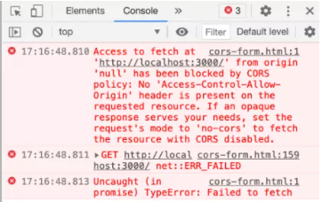

CORS 是前端工程师必不可避免的一个知识点了，在跟后端服务器请求数据或者使用接口的时候，大多数情况下都会遇到 CORS block policy 的报错信息，那么，我来记录一下 CORS 的详细的一些知识点吧。这也是我看到一篇博客后由心而生的想法，以小故事的形式来详解 CORS。

### Day1. 简单的 CORS

小明是一个刚进公司实习的实习生，他负责写一个页面，现在要求他获取后端数据并且渲染在页面上。而后端呢把自己封装好的 API 打包好丢给小明，让他先在本地跑跑试试看。

如果说后端起来的服务器地址是`localhost:3000`，则小明写了一段获取数据的代码：

```js
fetch("localhost:3000");
```

结果发现了一下的报错信息：


小明看到后瞬间就明白了，于是在请求中加入`no-cors`

```js
fetch("localhost:3000", {
  mode: "no-cors",
});
```

报错信息消失了，却还是获取不了数据，传回来的 status 为 0。

> `no-cors`无法解决跨域问题，它的意思是既不要报错信息，也不要 response 信息。

**Resolve**

解决跨域问题一定要在后端解决，这里小明让后端同学设置了一个 header：**Access-Control-Allow-Origin**

```js
app.get("/", (req, res) => {
  res.header("Access-Control-Allow-Origin", "*");
});
```

表示任何 origin 的网站都可以获取这个资源。

- 这里**Access-Control-Allow-Origin**的值只能设置 1 个或者全部通过。

### Day2. 不简单的 CORS

今天小明需要使用后端 api 来删除后台的数据。

```js
fetch("localhost:3000", {
  methods:'DELETE',
  headers:{'Content-Type','application/json'}
}).then(res=>console.log(res.json()));
```

但是小明发现这个请求又挂掉了。他切换到 network tab 里面去看信息，发现多了一个`Options`请求，上面还有一个`preflight request`。

这里要介绍一下**简单请求**的概念：

- 请求方法是`GET/POST/HEAD`
- 请求头不能有自定义的请求头，`Content-Type`也不能超出`application/x-www-form-urlencoded`、`text/plain`、`mutipart/form-data`。

因为上面的`DELETE`方法和`Content-Type`的值都不符合上述规则，所以这是一个非简单请求，那么非简单请求在发送之前，会多发出一个 preflight 预检请求`OPTIONS`,浏览器会自动给它带上 2 个请求头：

- `Access-Control-Request-Headers`:`Content-Type`
- `Access-Control-Request-Methods`:`DELETE`

这个请求是为了检验后端是否放行该非简单请求。

如果后端愿意放行则需要设置：

```js
app.get("/", (req, res) => {
  res.header("Access-Control-Allow-Origin", "*");
  // ...
});
/* 为了让预检通过 */
app.options("/form", (req, res) => {
  /* 注意要设置这3个放行 */
  res.header("Access-Control-Allow-Origin", "*");
  res.header("Access-Control-Allow-Headers", "Content-Type");
  res.header("Access-Control-Allow-Methods", "DELETE");
  //...
});
```

**预检不通过的时候，真正的请求是不会被发出的。**

### Day3.我要带上 Cookie

今天行销部门的人跟小明说，这些 request 都必须要带着 Cookie，我们要通过 Cookie 来做分析。

小明去 MDN 查了一下，在请求中带上了这个东西:

```js
fetch("localhost:3000", {
  methods:'DELETE',
  headers:{'Content-Type','application/json'},
  /* 新增这个 */
  credentials:include,
}).then(res=>console.log(res.json()));
```

但是却发现报错了：`The value of the 'Access-Control-Allow-Origin' header in the response muse not be the wildcard '*' when the request's credentials mode is 'include'`

很明显我们可以看出，当带上 Cookie 的时候，后端一定要明确放行的 Origin，除此之外，后端还必须带上：
**`Access-Control-Allow-Credentials:true`**

总结一下，要带上 Cookie 需要满足以下 3 个条件:

> - 前端：`credentials:include`
> - 后端： `Access-Control-Allow-Origin`必须是一个明确的 Origin
> - 后端：`Access-Control-Allow-Credentials:true`

### Day4. 存取自定义 Headers

今天产品来找小明，说希望能把后端传过来的一个 Header(`X-Version:1.7`)渲染在页面上。

小明心想，这不是很简单嘛，直接写出来了：

```js
fetch("localhost:3000", {
  methods:'DELETE',
  headers:{'Content-Type','application/json'},
  credentials:include,
}).then(res=>console.log(res.headers.get('X-Version')));
```

这时候小明却惊奇的发现，前端无论怎么操作，打印出来的都是 null，但是在 network tab 中看的时候，header 明明就是跟着 response 带过来了啊。

> 对于自定义的 headers，后端必须要设置可暴露：`Access-Control-Expose-Headers:X-Version`,设置后前端才可以通过代码获取到这个请求头。

**注意，只有几个基础 Headers 不需要暴露，如 Content-Type**

### Day5. 快取 preflight request

今天 QA 做压测的时候，发现 preflight request 的数量非常多，于是小明查了查资料，发现可能通过后端设置来解决这个问题：

```js
app.get("/", (req, res) => {
  res.header("Access-Control-Allow-Origin", "*");
  // ...
});
app.options("/form", (req, res) => {
  res.header("Access-Control-Allow-Origin", "*");
  res.header("Access-Control-Allow-Headers", "Content-Type");
  res.header("Access-Control-Allow-Methods", "DELETE");
  /* 新增这个 */
  res.header("Access-Control-Max-Age", 300);
  //...
});
```

> `Access-Control-Max-Age`表示在指定时间内(s)对同一资源的请求都不会再对后端作预检。可以类比强缓存。
