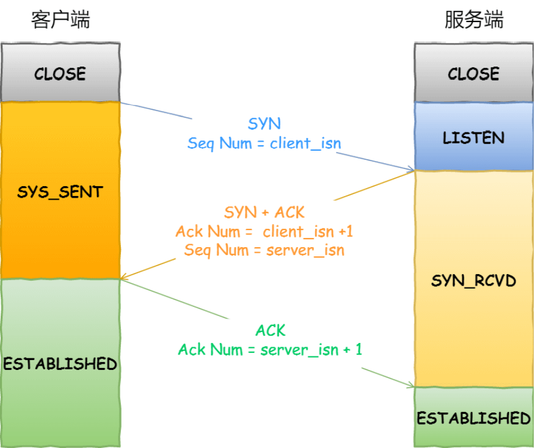
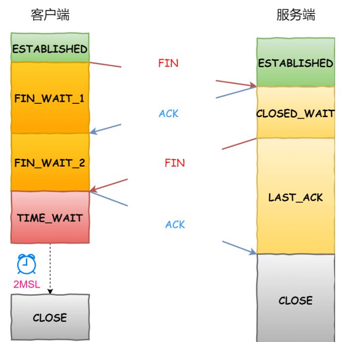

## 三次握手

三次握手（Three-way Handshake）其实就是指建立一个 TCP 连接时，需要客户端和服务器总共发送 3 个包。进行三次握手的主要作用就是为了确认双方的接收能力和发送能力是否正常、指定自己的初始化序列号为后面的可靠性传送做准备。实质上其实就是连接服务器指定端口，建立 TCP 连接，并同步连接双方的序列号和确认号，交换 TCP 窗口大小信息。

- 客户端和服务端都是 CLOSED 状态，先是服务端开始监听某个端口
- 第一次握手，客户端给服务端发送**SYN=1**报文和初始序列号**ISN=x**，此时不能携带数据，发送后客户端处于 **SYN_SEND**状态。
- 第二次握手，服务端收到客户端的请求后，返回**ACK=1**，**SYN=1**的响应。同时把[确认应答号]**ack=x+1**，自己的**ISN=y**也一并发送给客户端。此时也不能携带数据，然后处于**SYN_REVD**状态
- 第三次握手，客户端收到回应后，将返回收到的应答，ACK=1,同时 ack=y+1 也一起发送过去。客户端发送后处于**ESTABLISHED**状态。**这次可以携带数据的**。
- 服务器收到后也处于**ESTABLISHED**状态，此时连接建立成功了。

**为什么不两次握手呢？**

> 要是两次握手，即服务端只要收到客户端的请求立即建立链接。若客户端第一次发送请求的时候，数据包在网络上堵塞了，于是客户端超时重传发送第二次请求，服务端收到后建立链接，两者处理完事情后断开连接。此时第一次请求包到达服务端，服务端开启连接，但客户端没有任何响应，浪费资源。

**什么是半连接队列**

> 当服务端第一次收到 SYN 包后，处于 SYN-REVD 状态，服务器会把该状态下的请求连接放在一个队列里，叫做半连接队列。 当然还有一个全连接队列，就是已经完成三次握手，建立起连接的就会放在全连接队列中。如果队列满了就有可能会出现丢包现象。

> 当服务端发送完 SYN-ACK 包后没收到客户端的响应，则会进行首次重传。若继续无响应，则继续重传，当超过最大重传次数的时候，服务器会将该半连接从队列中删除。【注意】，每次重传的时间都不一样，一般会指数增加，如 2s，4s，8s。。。

**ISN(Initial Sequence Number)是固定的吗？**

> 不是固定的，它会根据时间的变化而变化。如果一个已经失效的旧连接到达了服务端，如果序列号相同，则无法判断是不是历史报文，会产生错误问题。另一方面，动态变化的 ISN 也是为了防止黑客伪造相同的 ISN 的 TCP 报文让对方接收。

> ISN 是基于时钟的，每 4ms+1，转一圈需要 4.55 个小时。

**三次握手过程中可以携带数据吗？**

> 其实第三次握手的时候，是可以携带数据的。但是，第一次、第二次握手不可以携带数据

> 为什么这样呢?大家可以想一个问题，假如第一次握手可以携带数据的话，如果有人要恶意攻击服务器，那他每次都在第一次握手中的 SYN 报文中放入大量的数据。因为攻击者根本就不理服务器的接收、发送能力是否正常，然后疯狂着重复发 SYN 报文的话，这会让服务器花费很多时间、内存空间来接收这些报文。

**SYN 攻击 (DDos)**

> 假设攻击者伪造大量不同 IP 的 SYN 报文，服务端每次接收一个 SYN 就要进入 SYN-REVD 状态，但是发出去的 SYN+ACK 报文不可能被响应，久而久之就是占满服务端的半连接队列。使得服务器不能正常工作。

## 四次挥手

终止一个 TCP 连接需要发送 4 个包，也就是 4 次挥手，这是因为 TCP 的半关闭造成的。所谓的半关闭，就是当连接的一方关闭连接后，还可以继续接收对方的数据包的能力。客户端和服务器均可主动发起挥手操作。

- 客户端和服务端都处于 ESTABLISHED 状态，假设是由客户端先发起关闭请求。
- 第一次挥手，客户端发送 **FIN=1 seq(序列号)=u **给服务端。此时客户端处于**FIN-WAIT-1**状态，同时也变成了**半关闭**状态。
- 第二次挥手，服务端收到 FIN 后，会发送 ACK=1，并且把 ack=u+1 作为确认号，自身的序列号 seq=v 也一并发给客户端。服务端进入**CLOSE-WAIT**状态，此时该**TCP 处于半关闭状态**。
- 当客户端收到后，进入**FIN-WAIT-2**状态，等待服务端的 FIN 报文。
- 第三次挥手，当服务端没有想传给客户端的数据后也想断开连接，则发送**FIN=1，ACK=1，seq=w，ack=u+1 **给客户端。此时服务端进入**LAST-ACK**状态
- 第四次挥手，客户端收到 FIN 报文后，发送一个 ACK=1，ack=w+1 给服务端，此时客户端进入 TIME-WAIT 状态，需要等待服务端收到自己的应答报文后再进入 CLOSED 状态。而服务端一收到客户端的应答后则进入 CLOSED 状态。
- **客户端在经过 2MSL ⼀段时间后，⾃动进⼊ CLOSED 状态，⾄此客户端也完成连接的关闭**

**为什么关闭连接需要 4 次挥手**

> 因为在服务端收到客户端的 FIN 报文后，手头上可能还有没发送完的数据，所以只能回一个 ACK 表示我收到了你的 FIN 报文，然后等自己的数据全部发送完成后，再发送 FIN 报文。故需要 4 次挥手。

**关于 CLOSE-WAIT**

**【注意】只有先发起 FIN 报文的那一方才有 CLOES-WAIT 状态。**

> MSL 是报文最大生存时间(maximun segment lifetime),它是任何报文段被丢弃前在网络内的最长时间。这个时间是有限的，因为 TCP 报文段以 **IP 数据报**在网络内传输，而 IP 数据报则有限制其生存时间的 **TTL 字段**。 MSL 与 TTL 的区别： MSL 的单位是时间，⽽ TTL 是经过路由跳数。所以 MSL 应该要⼤于等于 TTL 消耗为 0 的时间，以确保报⽂已被⾃然消亡

> TIME_WAIT 等待 2 倍的 MSL，⽐较合理的解释是：若客户端的 ACK 报文丢失之后，服务端触发超时重传 FIN 报文给客户端，客户端收到后还要发送 ACK，这样一来一回的时间是 2MSL。(如果客户端收到服务端超时重传后的 FIN，TIME-WAIT 需要重新计时)
